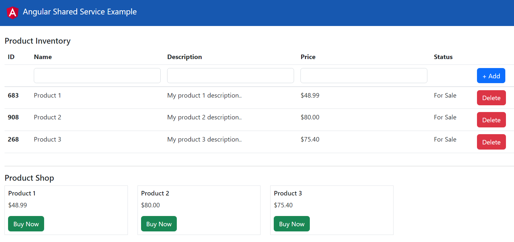

# Angular Shared Service Example

This project was generated with [Angular CLI](https://github.com/angular/angular-cli) version 15.0.3.

## Introduction

I've created an Angular Shared Service consisting of 1 parent component and 2 child components:
- Parent: AppComponent
- Child1: ProductInventoryComponent
- Child2: ProductShopComponent



#### app.component.ts
```html
<div class="container mt-4">
  <product-inventory></product-inventory>
  <hr>
  <product-shop></product-shop>
</div>
```

## Shared Data Service
Here, I've created ProductSharedService, which is shared between the parent and child components. As you can, I set the initialsProducts data in $productBS just so we can have some initial data to work with straight away.

#### product-shared.service.ts
```typescript
import { Injectable } from "@angular/core";
import { BehaviorSubject } from "rxjs";
import { IProduct } from '../interfaces/product.interface';
import initialProducts from '../data/initial-products.data';

@Injectable()
export class ProductSharedService {
    private $productBS = new BehaviorSubject<IProduct[]>(initialProducts);
    public productSharedData = this.$productBS.asObservable();

    public updateProductSharedData(data: IProduct[]): void {
        this.$productBS.next(data);
    }
}
```

#### initial-products.data.ts
```typescript
import { IProduct } from '../interfaces/product.interface';
import { Product } from '../classes/product.class';

const initialProducts: IProduct[] = [
    new Product('Product 1', 'My product 1 description..', 48.99),
    new Product('Product 2', 'My product 2 description..', 80.00),
    new Product('Product 3', 'My product 3 description..', 75.40)
];

export default initialProducts;
```

Next, I added ProductSharedService to NgModule.providers in AppModule. The ProductSharedService will then be injected inside of the child components constructor.
#### app.module.ts
```typescript
  providers: [
    ProductSharedService
  ]
```

## Retrieving & Updating The Shared Data
Once the ngOnInit lifecycle hook is triggered in ProductInventoryComponent & ProductShopComponent, the initial products data is outputted from the subscribe observable and the data is then set to the productsData class property.
#### product-inventory.component.ts & product-store.component.ts
```typescript
    ngOnInit(): void {
        this.productService.productSharedData
            .subscribe({
                next: (data: IProduct[]) => this.productsData = data,
                error: err => console.log(err)
            });
    }
```

This subscribe observable will output new or updated data every single time data is pushed to the $productBS BehaviorSubject.

For example, in ProductInventoryComponent, there are the add & delete methods, and in ProductShopComponent, there is the buy method:

#### product-inventory.component.ts
```typescript
    public add(values: IProduct): void {
        if (this.form.valid) {
            this.productsData.push(new Product(values.name, values.description, values.price));
            this.productService.updateProductSharedData(this.productsData);
            this.form.reset();
        }
    }

    public delete(index: number): void {
        this.productsData.splice(index, 1);
        this.productService.updateProductSharedData(this.productsData);
    }
```

#### product-shop.component.ts
```typescript
    public buy(index: number): void {
        this.productsData[index].status = StatusEnum.Sold;
        this.productService.updateProductSharedData(this.productsData);
    }
```

If one of these methods (add, delete, buy) are called, the updated data will be pass through the updateProductSharedData() method, which then pushes the updated data into $productBS via the next() method. Upon updating, the ngOnInit subscribe observable will then output the newly updated products data in both ProductInventoryComponent & ProductShopComponent in real-time. Therefore, these 2 components will share the exact same products data.

## ProductInventoryComponent
#### product-inventory.component.ts
```typescript
export class ProductInventoryComponent implements OnInit {
    public productsData: IProduct[];
    public form: FormGroup;

    constructor(
        private productService: ProductSharedService,
        private fb: FormBuilder
    ) {
        this.productsData = new Array<IProduct>();

        this.form = this.fb.group<IProductForm>({
            name: new FormControl<string | null>('', Validators.required),
            description: new FormControl<string | null>('', Validators.required),
            price: new FormControl<number | null>(null, Validators.required)
        });
    }

    ngOnInit(): void {
        this.productService.productSharedData
            .subscribe({
                next: (data: IProduct[]) => this.productsData = data,
                error: err => console.log(err)
            });
    }

    public add(values: IProduct): void {
        if (this.form.valid) {
            this.productsData.push(new Product(values.name, values.description, values.price));
            this.productService.updateProductSharedData(this.productsData);
            this.form.reset();
        }
    }

    public delete(index: number): void {
        this.productsData.splice(index, 1);
        this.productService.updateProductSharedData(this.productsData);
    }
}
```

## ProductShopComponent
#### product-shop.component.ts
```typescript
export class ProductShopComponent implements OnInit {
    public productsData: IProduct[];
    public statusSold: StatusType;

    constructor(private productService: ProductSharedService) {
        this.productsData = new Array<IProduct>();
        this.statusSold = StatusEnum.Sold;
    }

    ngOnInit(): void {
        this.productService.productSharedData
            .subscribe({
                next: (data: IProduct[]) => this.productsData = data,
                error: err => console.log(err)
            });
    }

    public buy(index: number): void {
        this.productsData[index].status = StatusEnum.Sold;
        this.productService.updateProductSharedData(this.productsData);
    }
}
```

## Wrap Up
I hope this example was helpful. To get a deeper understanding of this Angular Share Service Example - download, compile, and run this code example. Click the +Add, Delete, and Buy Now buttons and you'll be able to visually see the shared products data updating in real-time in both ProductInventoryComponent & ProductShopComponent.

---

## Development server

Run `ng serve` for a dev server. Navigate to `http://localhost:4200/`. The application will automatically reload if you change any of the source files.

## Code scaffolding

Run `ng generate component component-name` to generate a new component. You can also use `ng generate directive|pipe|service|class|guard|interface|enum|module`.

## Build

Run `ng build` to build the project. The build artifacts will be stored in the `dist/` directory.

## Running unit tests

Run `ng test` to execute the unit tests via [Karma](https://karma-runner.github.io).

## Running end-to-end tests

Run `ng e2e` to execute the end-to-end tests via a platform of your choice. To use this command, you need to first add a package that implements end-to-end testing capabilities.

## Further help

To get more help on the Angular CLI use `ng help` or go check out the [Angular CLI Overview and Command Reference](https://angular.io/cli) page.